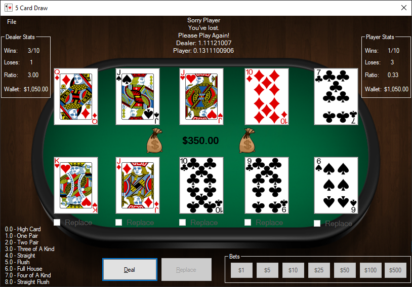
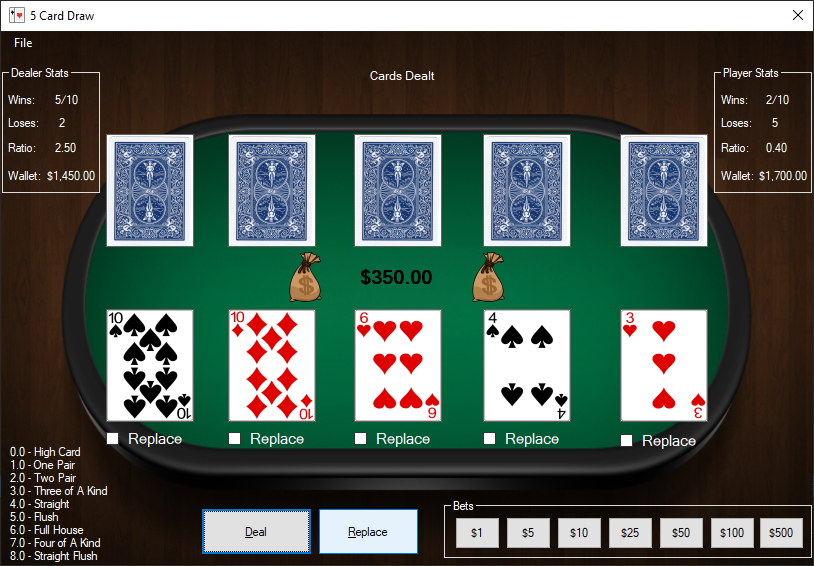
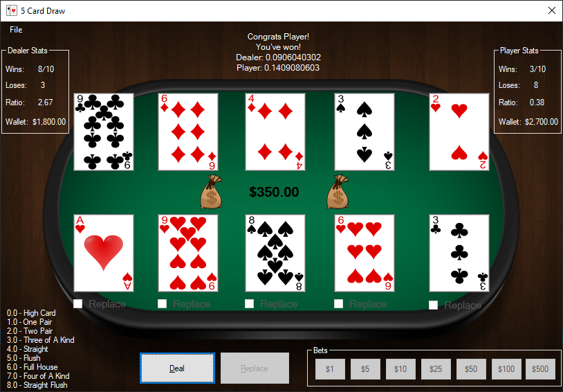

# FiveCardDraw 

This application is an implementation of five card draw originally written in VB.net but re-written in C# Windows Forms. The project was re-written in 12/03/2016.

***This version is not currently being worked on***
  * May add new controls with Xaml Islands at some point

# Screenshots

##### Player lost, dealer one with one pair:

##### Cards are dealt, you can bet or replace cards:

##### Player won by ace, 14 = Ace: 

## Getting Started

### Prerequisites

## Built With

C# Windows Forms

## Contributing

[Coming Soon]

## Authors

* **Hunter** - *Initial work* - [hjohnson012](https://github.com/hjohnson012)

See also the list of [contributors](https://github.com/hjohnson12/NotepadEditorUWP/graphs/contributors) who participated in this project.

## License

This project is licensed under the MIT License - see the [LICENSE.md](LICENSE.md) file for details
